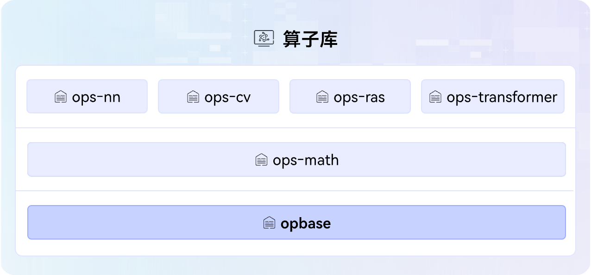

<div align="center">

# opbase

简体中文 | [English](./README_en.md)

[](https://www.hiascend.com/document/redirect/CannCommunityOplist)
[](docs)
[](LICENSE)
[](CONTRIBUTING.md)
[](https://gitcode.com/cann/community/blob/master/CANN/sigs/ops-basic/README.md)
[![Zread](https://img.shields.io/badge/Zread-Ask_AI-_.svg?style=flat&color=0052D9&labelColor=000000&logo=data%3Aimage%2Fsvg%2Bxml%3Bbase64%2CPHN2ZyB3aWR0aD0iMTYiIGhlaWdodD0iMTYiIHZpZXdCb3g9IjAgMCAxNiAxNiIgZmlsbD0ibm9uZSIgeG1sbnM9Imh0dHA6Ly93d3cudzMub3JnLzIwMDAvc3ZnIj4KPHBhdGggZD0iTTQuOTYxNTYgMS42MDAxSDIuMjQxNTZDMS44ODgxIDEuNjAwMSAxLjYwMTU2IDEuODg2NjQgMS42MDE1NiAyLjI0MDFWNC45NjAxQzEuNjAxNTYgNS4zMTM1NiAxLjg4ODEgNS42MDAxIDIuMjQxNTYgNS42MDAxSDQuOTYxNTZDNS4zMTUwMiA1LjYwMDEgNS42MDE1NiA1LjMxMzU2IDUuNjAxNTYgNC45NjAxVjIuMjQwMUM1LjYwMTU2IDEuODg2NjQgNS4zMTUwMiAxLjYwMDEgNC45NjE1NiAxLjYwMDFaIiBmaWxsPSIjZmZmIi8%2BCjxwYXRoIGQ9Ik00Ljk2MTU2IDEwLjM5OTlIMi4yNDE1NkMxLjg4ODEgMTAuMzk5OSAxLjYwMTU2IDEwLjY4NjQgMS42MDE1NiAxMS4wMzk5VjEzLjc1OTlDMS42MDE1NiAxNC4xMTM0IDEuODg4MSAxNC4zOTk5IDIuMjQxNTYgMTQuMzk5OUg0Ljk2MTU2QzUuMzE1MDIgMTQuMzk5OSA1LjYwMTU2IDE0LjExMzQgNS42MDE1NiAxMy43NTk5VjExLjAzOTlDNS42MDE1NiAxMC42ODY0IDUuMzE1MDIgMTAuMzk5OSA0Ljk2MTU2IDEwLjM5OTlaIiBmaWxsPSIjZmZmIi8%2BCjxwYXRoIGQ9Ik0xMy43NTg0IDEuNjAwMUgxMS4wMzg0QzEwLjY4NSAxLjYwMDEgMTAuMzk4NCAxLjg4NjY0IDEwLjM5ODQgMi4yNDAxVjQuOTYwMUMxMC4zOTg0IDUuMzEzNTYgMTAuNjg1IDUuNjAwMSAxMS4wMzg0IDUuNjAwMUgxMy43NTg0QzE0LjExMTkgNS42MDAxIDE0LjM5ODQgNS4zMTM1NiAxNC4zOTg0IDQuOTYwMVYyLjI0MDFDMTQuMzk4NCAxLjg4NjY0IDE0LjExMTkgMS42MDAxIDEzLjc1ODQgMS42MDAxWiIgZmlsbD0iI2ZmZiIvPgo8cGF0aCBkPSJNNCAxMkwxMiA0TDQgMTJaIiBmaWxsPSIjZmZmIi8%2BCjxwYXRoIGQ9Ik00IDEyTDEyIDQiIHN0cm9rZT0iI2ZmZiIgc3Ryb2tlLXdpZHRoPSIxLjUiIHN0cm9rZS1saW5lY2FwPSJyb3VuZCIvPgo8L3N2Zz4K&logoColor=ffffff)](https://zread.ai/hicann/opbase)

</div>

---

## 🔥Latest News

- [2025/12] 支持kirinx90，支持离线编译。
- [2025/09] opbase项目首次上线。

## 🚀概述

opbase是[CANN](https://hiascend.com/software/cann) （Compute Architecture for Neural Networks）算子库依赖的基础框架库，其提供基础的调度能力和公共依赖项，包括公共的头文件、结构体、调度框架等。关于CANN算子库请访问[ops-math](https://gitcode.com/cann/ops-math)、[ops-nn](https://gitcode.com/cann/ops-nn)、[ops-cv](https://gitcode.com/cann/ops-cv)、[ops-transformer](https://gitcode.com/cann/ops-transformer)获取算子源码实现详情。



## 📌版本配套

本项目源码会跟随CANN软件版本发布，关于CANN软件版本与本项目标签的对应关系请参阅[release仓库](https://gitcode.com/cann/release-management)中的相应版本说明。
请注意，为确保您的源码定制开发顺利进行，请选择配套的CANN版本与Gitcode标签源码，使用master分支可能存在版本不匹配的风险。

## 🛠️环境准备

[环境部署](docs/zh/install/quick_install.md)是体验本项目能力的前提，请先完成NPU驱动、CANN包安装等，确保环境正常。

## ⬇️源码下载

环境准备好后，下载与CANN版本配套的分支源码，命令如下，\$\{tag\_version\}替换为分支标签名。

> 说明：若环境中已存在配套分支源码，**可跳过本步骤**。

```bash
git clone -b ${tag_version} https://gitcode.com/cann/opbase.git
```

## 📖学习教程

- [快速入门](docs/QUICKSTART.md)：从零开始快速体验项目源码构建和功能本地验证（如UT）操作。
- [进阶教程](docs/README.md)：如需深入了解算子调用/开发场景下依赖的框架API、指南等，请查阅文档中心获取详细指引。

## 💬相关信息

- [目录结构](docs/zh/appendix/dir_structure.md)
- [贡献指南](CONTRIBUTING.md)
- [安全声明](SECURITY.md)
- [许可证](LICENSE)
- [所属SIG](https://gitcode.com/cann/community/tree/master/CANN/sigs/ops-basic)

---

本项目功能和文档正在持续更新和完善中，欢迎您关注最新版本。

- **问题反馈**：通过GitCode[【Issues】](https://gitcode.com/cann/opbase/issues)提交问题
- **社区互动**：通过GitCode[【讨论】](https://gitcode.com/cann/opbase/discussions)参与交流
