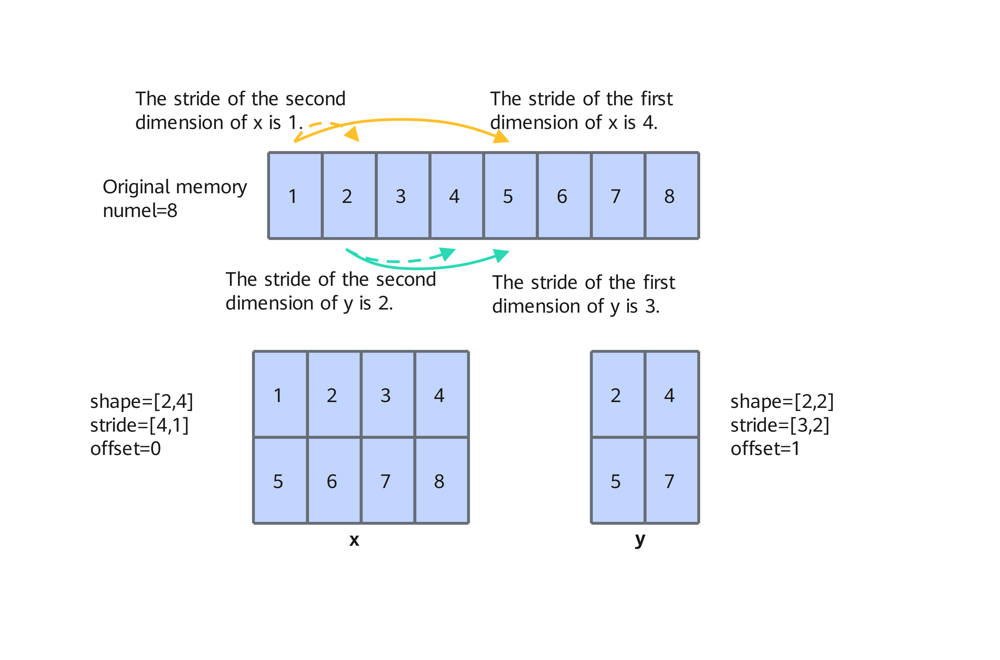

# aclCreateTensor

## Function

Creates an aclTensor object based on the tensor data type, data layout format, dimension, stride, offset, and device storage address. This object is used as the input parameter for single-operator API execution.

aclTensor is a framework-defined structure used to manage and store tensor data. You can use it without learning about its internal implementation.

## Prototype

```cpp
aclTensor *aclCreateTensor(const int64_t *viewDims, uint64_t viewDimsNum, aclDataType dataType, const int64_t *stride, int64_t offset, aclFormat format, const int64_t *storageDims, uint64_t storageDimsNum, void *tensorData)
```

## Parameters

> StorageShape and ViewShape of aclTensor:
>
> - ViewShape indicates the logical shape of the tensor, which is the size of the tensor required for actual use.
> - StorageShape indicates the actual physical layout shape of the tensor, which is the actual size of the tensor in the memory.
> The following is an example:
> - If StorageShape is \[10, 20\], the tensor is arranged in the memory based on \[10, 20\].
> - If ViewShape is \[2, 5, 20\], the tensor can be considered as a data block \[2, 5, 20\] for operator use.

| Parameter| Input/Output| Description|
| --- | --- | --- |
| viewDims | Input| ViewShape dimension value of a tensor, which is a non-negative integer.|
| viewDimsNum | Input| ViewShape dimension number of a tensor.|
| dataType | Input| Data type of a tensor.|
| stride | Input| Access stride of elements in each dimension of the tensor, which is a non-negative integer.|
| offset | Input| Offset of the first element of the tensor relative to storage, which is a non-negative integer.|
| format | Input| Tensor format.|
| storageDims | Input| StorageShape dimension value of the tensor, which is a non-negative integer.|
| storageDimsNum | Input| StorageShape dimension number of a tensor.|
| tensorData | Input| Storage address of the tensor on the device. The address must be 32-byte aligned. Otherwise, an undefined error may occur.|

## Returns

Created aclTensor on success; else, nullptr.

## Restrictions

- This API must be used together with [aclDestroyTensor](aclDestroyTensor.md). They are used to create and destroy the aclTensor, respectively.
- To create multiple aclTensor objects, call [aclCreateTensorList](aclCreateTensorList.md) to store the tensor list.
- You can call the [aclGetDataType](aclGetDataType.md) API to obtain the data type of the aclTensor.
- You can call the [aclGetFormat](aclGetFormat.md) API to obtain the format of the aclTensor.
- You can call the [aclGetStorageShape](aclGetStorageShape.md) API to obtain the storage shape of the aclTensor.
- You can call the [aclGetViewOffset](aclGetViewOffset.md) API to obtain the ViewOffset of the aclTensor, that is, the offset corresponding to the ViewShape.
- You can call the [aclGetViewShape](aclGetViewShape.md) API to obtain the ViewShape of the aclTensor.
- You can call the [aclGetViewStrides](aclGetViewStrides.md) API to obtain the ViewStrides of the aclTensor, that is, the stride corresponding to the ViewShape.
- You can call the [aclInitTensor](aclInitTensor.md) API to initialize the parameters of a given tensor.
- The following APIs can be called to update or obtain the device memory addresses recorded in the aclTensor in different scenarios.
  - [aclSetInputTensorAddr](aclSetInputTensorAddr.md)
  - [aclSetOutputTensorAddr](aclSetOutputTensorAddr.md)
  - [aclSetTensorAddr](aclSetTensorAddr.md)
  - [aclGetRawTensorAddr](aclGetRawTensorAddr.md)
  - [aclSetRawTensorAddr](aclSetRawTensorAddr.md)

## Examples

The definition of aclTensor is similar to that of [torch.Tensor](https://pytorch.org/docs/stable/tensors.html). aclTensor consists of a continuous or discontinuous memory address and a series of description information (such as stride and offset). Based on the shape, stride, and offset information, the tensor can fetch data from the memory or obtain discontiguous memory (for example, y in the below figure).

**Figure 1** Logical structure of a tensor



- The following uses the above figure as an example to describe how to create an x tensor:

    ```cpp
    aclTensor *CreateXTensor()
    {    
        std::vector<int64_t> viewDims = {2, 4};
        std::vector<int64_t> stride = {4, 1}; // The stride of the first dimension is 4, and that of the second dimension is 1.
        std::vector<int64_t> storageDims = {2, 4};       
        return aclCreateTensor(viewDims.data(), 2, ACL_FLOAT16, stride.data(), 0, ACL_FORMAT_ND, storageDims.data(), 2, nullptr);
    }
    ```

- The following uses the preceding figure as an example to describe how to create a transposed x^T tensor corresponding to x:

    ```cpp
    aclTensor *CreateXTransposedTensor()
    {
        std::vector<int64_t> viewDims = {4, 2};       
        std::vector<int64_t> stride = {1, 4};         // transpose stride
        std::vector<int64_t> storageDims = {2, 4};    
        return aclCreateTensor(viewDims.data(), 2, ACL_FLOAT16, stride.data(), 0, ACL_FORMAT_ND, storageDims.data(), 2, nullptr);
    }
    ```

According to the preceding examples, the code that uses aclTensor as the input parameter for single-operator API execution is as follows. The following code examples are for reference only and are not intended for direct copying and execution:

```cpp
// Create an aclTensor.
aclTensor *xTensor = CreateXTensor();
aclTensor *xTransposedTensor = CreateXTransposedTensor();
// Use the aclTensor as the input parameter for single-operator API execution.
auto ret = aclxxXxxGetWorkspaceSize(xTensor, xTransposedTensor, ..., outTensor, ..., &workspaceSize, &executor);
ret = aclxxXxx(...);
...
// Destroy the aclTensor.
ret = aclDestroyTensor(xTensor);
ret = aclDestroyTensor(xTransposedTensor);
```
